- # **CyberBrick Led使用说明**
- *注意：最新说明请从文中`Git`地址获取*

- 准备好所有部件，包括一个MOSS外壳、一个CyberBrick外壳、一个CyberBrick接收板

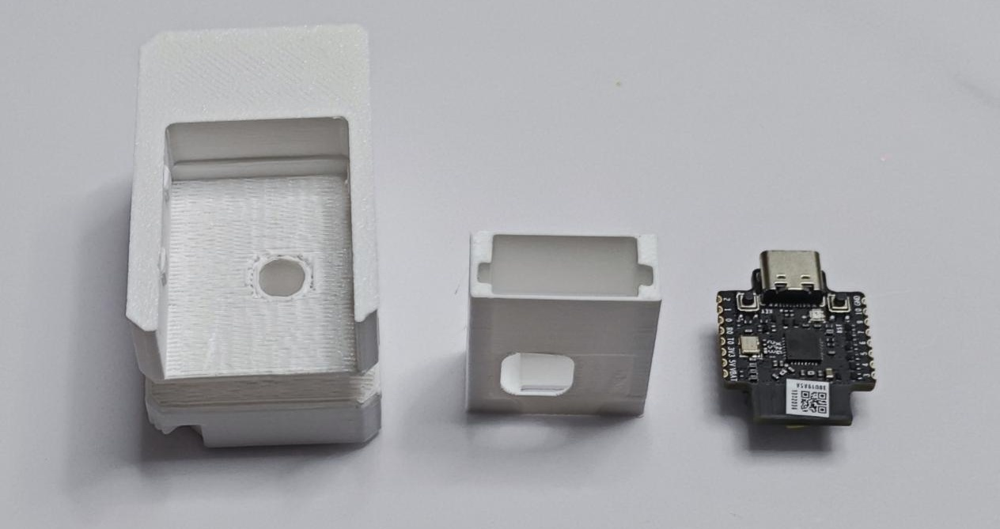

- 将接收板插入CyberBrick外壳中

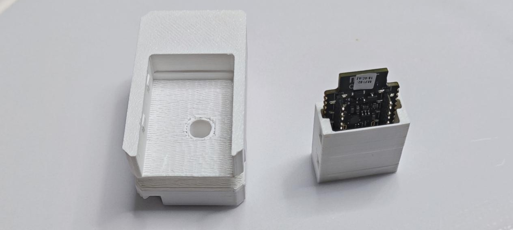

- 确保Type-C的金属头从开口中露出

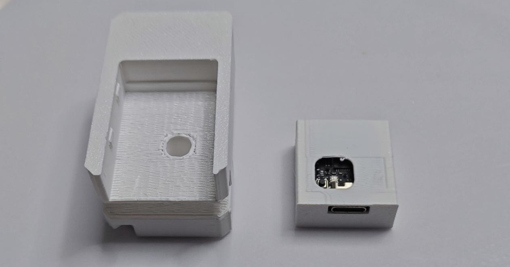

- 将CyberBrick外壳插入MOSS外壳，并用力推到底

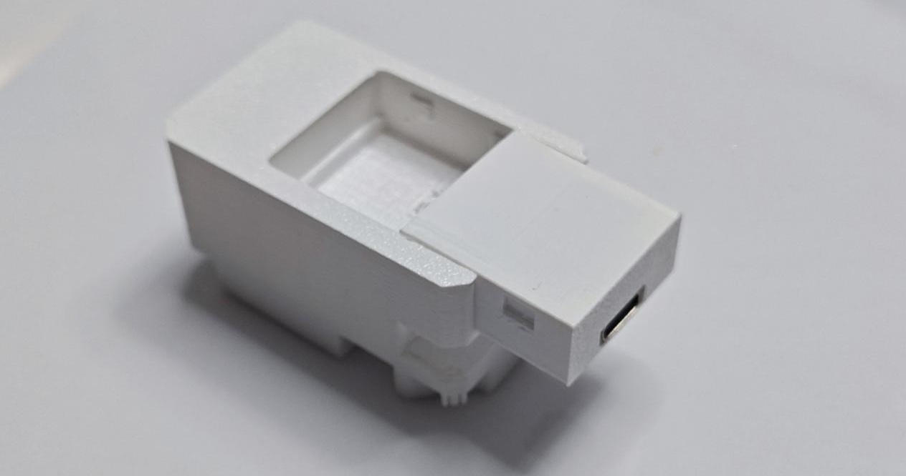

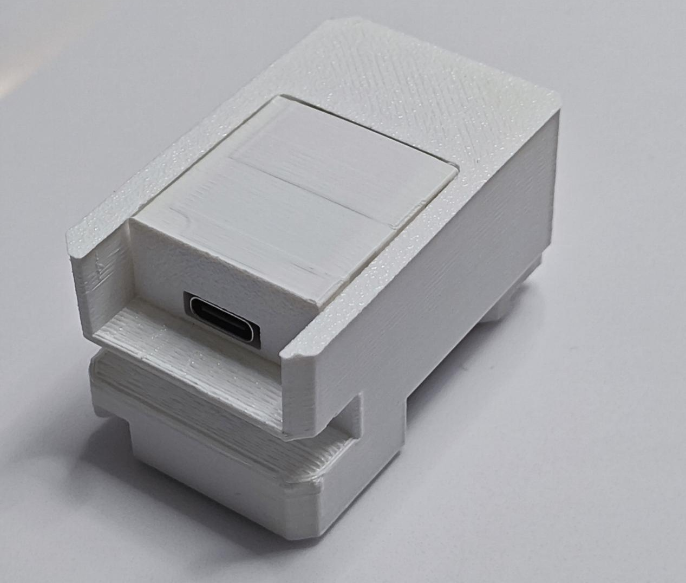

- 确认可从MOSS小洞中看到LED

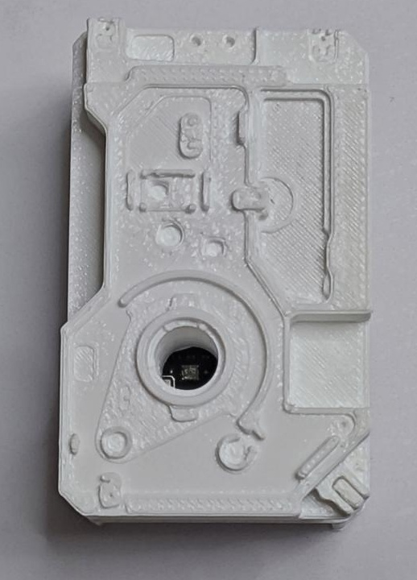

- 前往Github/Gitee下载软件，会Git的根据下面地址自行克隆，不懂的进入页面按如下箭头指示下载压缩包

[https://gitee.com/kujj/cyber-brick-led](https://gitee.com/kujj/cyber-brick-led)

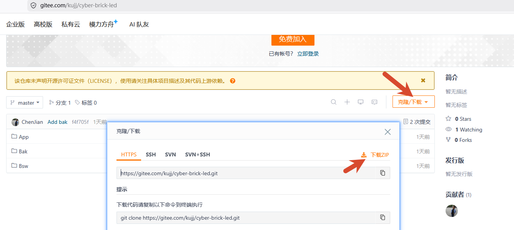

[github.com/kujj31gmail/cyber-brick-led">https://`github`.com/kujj31gmail/cyber-brick-led](https://<code class=)

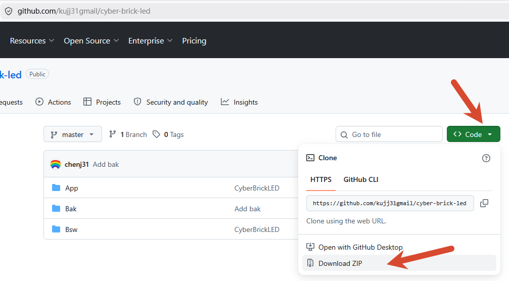

- 下载到本地后，先在电脑上插上USB线，连接CyberBrick接收板，进入设备管理器，确认串口的编号

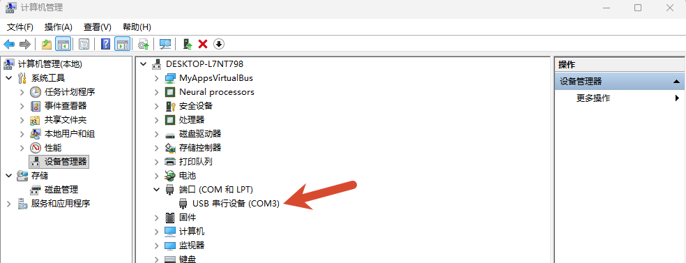

- 运行Bsw目录下的deploy.bat即可完成部署

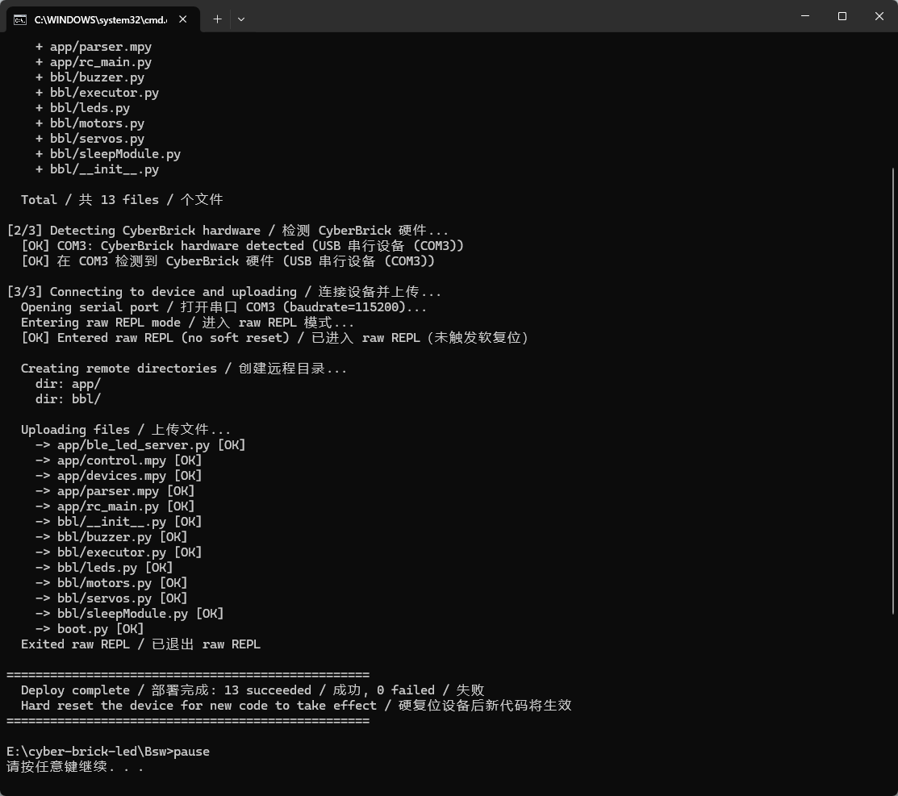

如果串口编号没有自动识别，需要在命令行中采用如下命令手动指定，下面的COM3根据上一步确认的实际端口为准：

deploy.exe --port COM3

该工具如果人气高，后期我也可以开源，供大家自行开发使用

- 重新插拔USB后，进入App目录，运行控制上位机

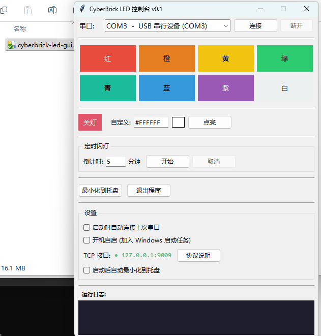

- 选择对应的串口编号，连接后即可点亮LED

如果大家需要开发更多功能，可以使用说明中的接口自行开发

我也可以根据大家的需求，迭代本软件。

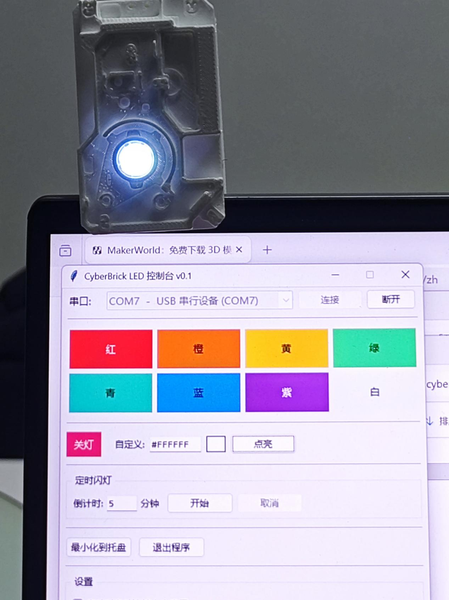
